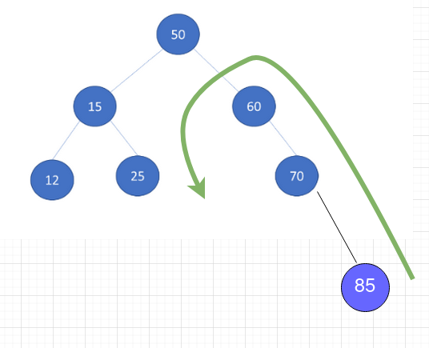
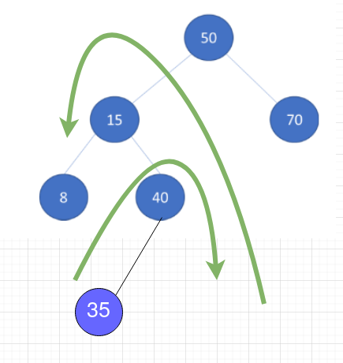

## Q1

a) Which node is the root node? 

A

b) Which nodes are leaf nodes? 

D, G, H, F

| Node | leaf | Sibling | Depth |
| --|:--:| :--: | --: |
| A |  |  | 0 |
| B |  | C | 1 |
| C |  | B | 1 |
| D | X | E | 2 |
| E |  |  | 2 |
| F | X |  | 2 |
| G | X | H | 3 |
| H | X | G | 3 |

a) preorder:
A, B, D, E, G, H, C, F

b) inorder:
D, B, G, E, H, A, F, C

c) postorder:
D, G, H, E, B, F, C, A

## Q2

a) Ja, det er balansert

b) Nei, det er ikke balansert

c) Nei, det er ikke balanser

