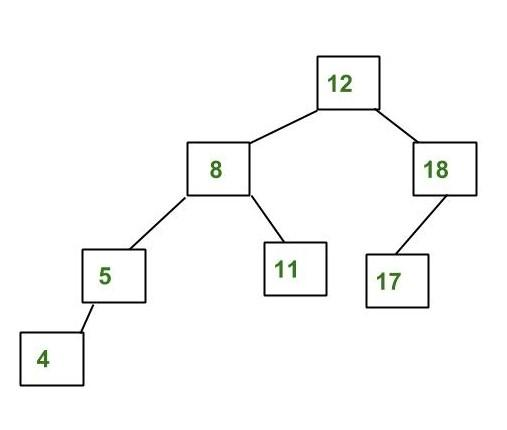

1. Show the result when an initially empty AVL tree has keys 2, 1, 4, 5, 9, 3, 6, 7  inserted in order.
Then the node in the last level will be:

- [ ] 9
- [ ] 6,7
- [x] 7
- [ ] 5,9

2. Suppose the numbers 7, 5, 1, 8, 3, 6, 0, 9, 4, 2 are inserted in that order into an initially empty binary search tree. The binary search tree uses the usual ordering of natural numbers.

Will the in-order traversal sequence of the resultant tree be the same for the numbers in the sequence 9,7, 5, 1, 8, 3, 2,6, 0, 4  ?

- [ ] No
- [x] Yes <- egentlig feil

3. The following numbers are inserted into an empty binary tree and binary search tree in the given order: 20,10, 1, 3, 5, 15, 12, 16,34,87,35. The height of the binary tree and binary search tree, respectively, is.
- [ ] 4,4
- [ ] 3,3
- [ ] 4,3
- [x] 3,4

4. Construct a binary tree by using inorder and preorder sequences given below.
Inorder:  D,B,H,E,I,A,F,C,G

Preorder:  A,B,D,E,H,I,C,F,G

Find the postorder traversal?

- [x] D,H,I,E, B,F,G,C ,A
- [ ] A,C,G,F,B,I,E,H,D
- [ ] D,H,E,I,B,F,G,C,A
- [ ] D,H,I,E,G,F,B,C,A

5. What is the maximum height of any AVL tree with 7 nodes?
Gruppe av svaralternativer

- [ ] 5
- [x] 3
- [ ] 4
- [ ] 2

6. Consider the given AVL Tree. 

if node 2 is added to this, then the parent node of 5 in a balanced tree is: 
Gruppe av svaralternativer

- [ ] 8
- [ ] 12
- [x] 4
- [ ] 11
