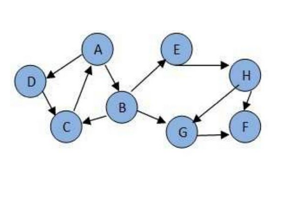
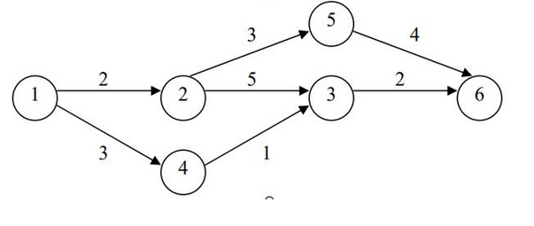
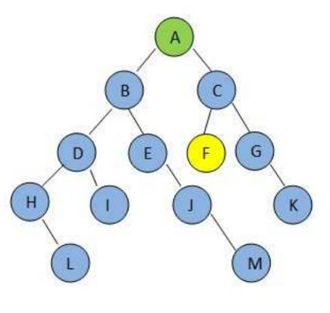

1. Consider the following graph. If there is ever a decision between multiple neighbor nodes in the BFS or DFS algorithms, assume we always choose the letter closest to the beginning of the alphabet first.

In what order will the nodes be visited using a Breadth First Search? 

- [ ] ABCDEFGH
- [X] ABDCEGHF
- [ ] ABDECGHF

2. Consider graph in the previous questions. In what order will the nodes be visited using a Depth First Search?

- [x] ABCEHFGD
- [ ] ABCEHFDG
- [ ] ABECHGFD

3. Consider the following directed graph. 

Use Dijkstra’s algorithm to decide the shortest path from vertex 1 to each of the other vertices. The initial values for the distances are given for you.  list the vertices in the order that they are traveresed as the algorithm is executed

- [x] 124356
- [ ] 125346
- [ ] 123456
- [ ] 123564

4. Consider the following graph:

The goal is to find node F using BFS algorithm. which BFS is correct? 

- [X] ABCDE
- [ ] ACF
- [ ] ABDE

5. 

Consider the graph in the previous question. The goal is to find node F using DFS algorithm. which dfs is correct? 
- [ ] ABCDIHLEJMC
- [ ] ABCDEHIJLMC
- [ ] ABCDE
- [x] ABDHLIEJMC

  